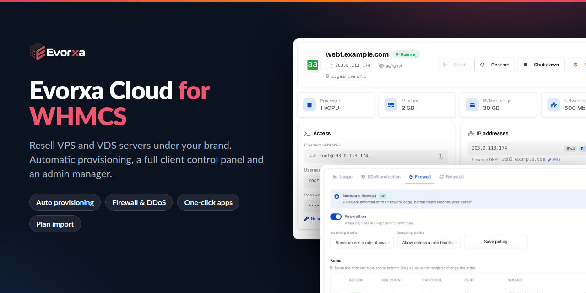
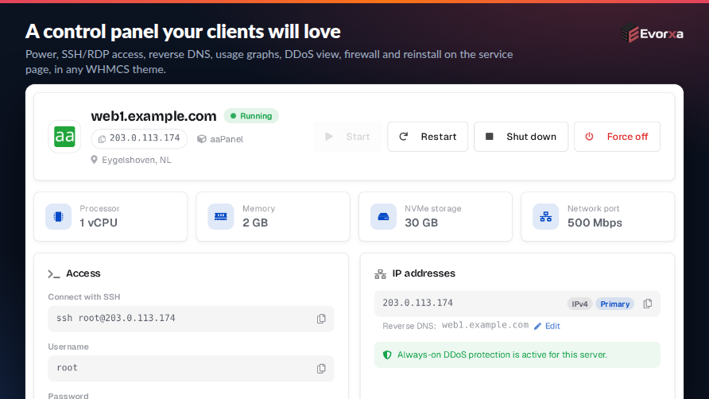
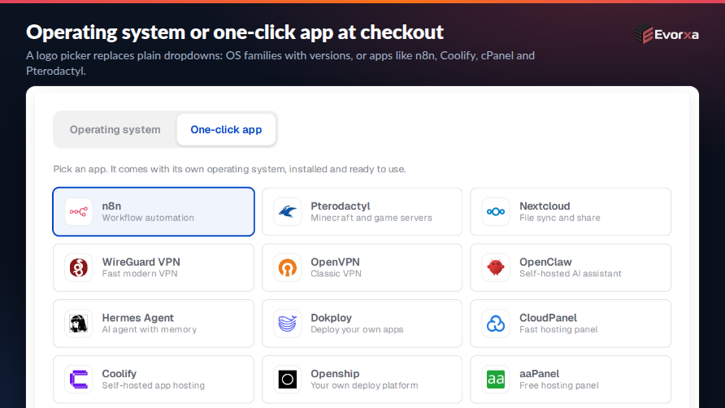
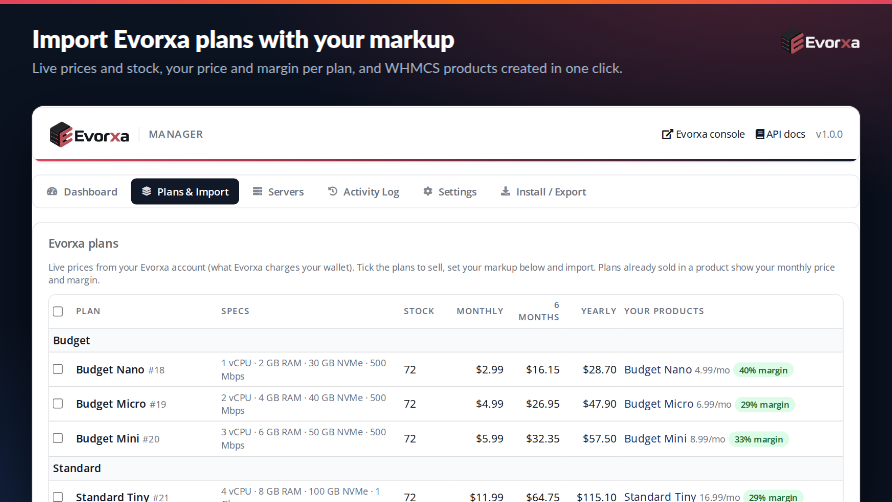
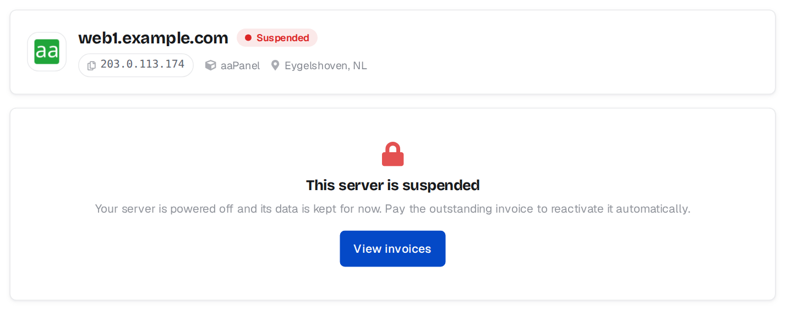
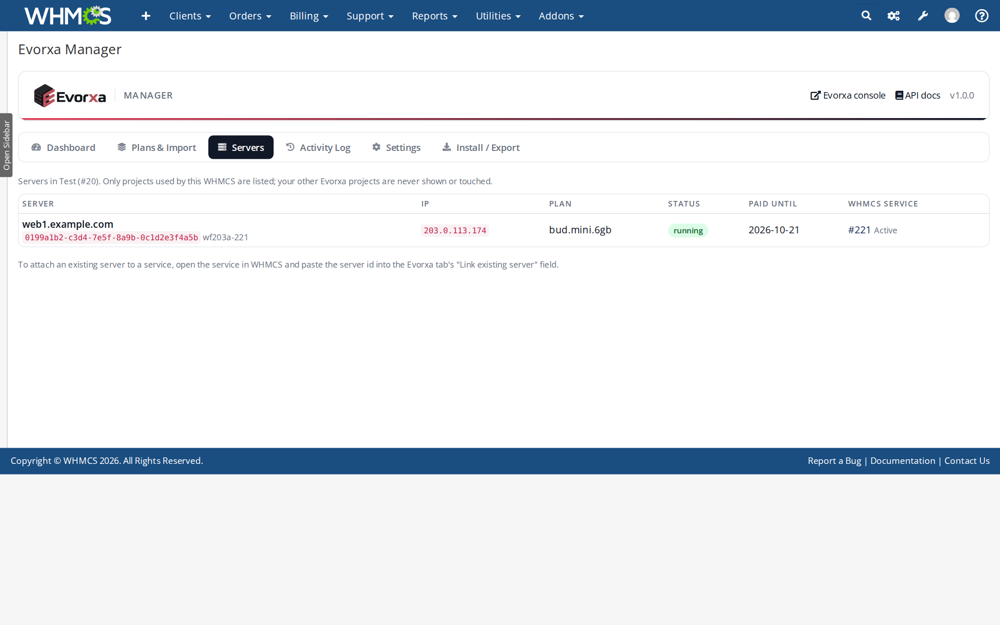
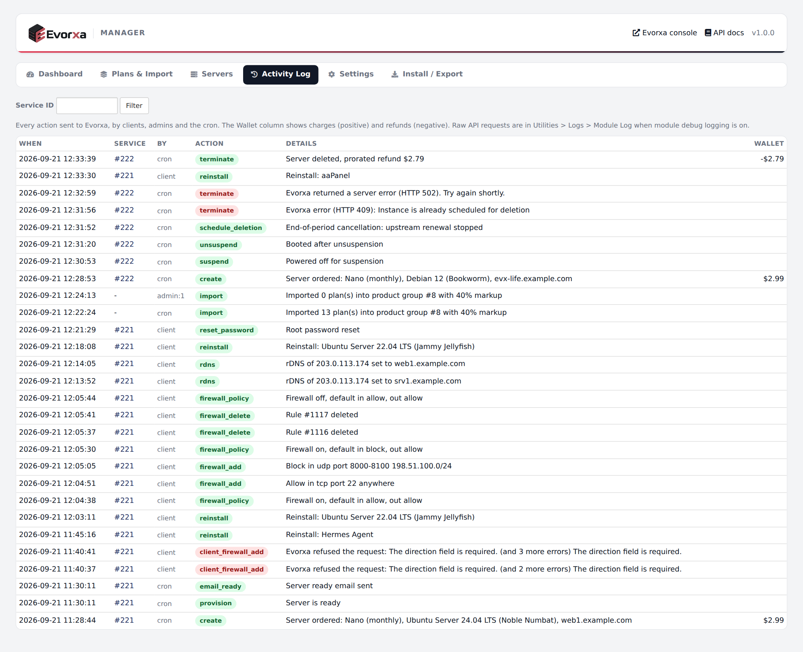
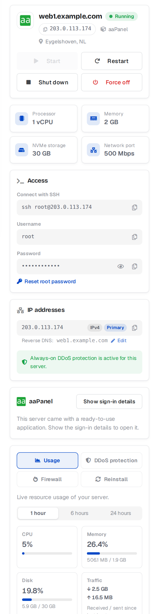

<p align="center">
  
</p>

<h1 align="center">Evorxa Cloud for WHMCS</h1>

<p align="center">
  <b>Resell Evorxa VPS and VDS cloud servers from WHMCS, under your own brand.</b><br>
  Automatic provisioning, a full client control panel and an admin manager for prices, stock, renewals and wallet alerts.
</p>

<p align="center">
  <a href="https://github.com/ScaleBit-Technologies/evorxa-whmcs/releases/latest"></a>
  
  
  
  <a href="https://github.com/ScaleBit-Technologies/evorxa-whmcs/releases/latest/download/evorxa-whmcs.zip"></a>
</p>

<p align="center">
  <a href="#install">Install</a> ·
  <a href="#features">Features</a> ·
  <a href="#screenshots">Screenshots</a> ·
  <a href="modules/servers/evorxa/docs/INSTALL.md">Installation guide</a> ·
  <a href="modules/servers/evorxa/docs/USAGE.md">How to use</a> ·
  <a href="modules/servers/evorxa/docs/CHANGELOG.md">Changelog</a>
</p>

---

**Evorxa Cloud** is a WHMCS provisioning module and admin addon for hosting companies that want to sell cloud servers without running their own hypervisors. Your clients order a VPS in your WHMCS store. When the invoice is paid, the server is created on your [Evorxa](https://evorxa.com) account in about a minute. The client then gets a branded "server ready" email and a complete control panel on the service page. Suspensions, terminations with prorated refunds, upgrades and renewals are handled for you.

## Install

### One command (SSH)

```bash
curl -fsSL https://raw.githubusercontent.com/ScaleBit-Technologies/evorxa-whmcs/master/install.sh | bash -s -- /path/to/whmcs
```

Replace `/path/to/whmcs` with the folder that contains WHMCS's `init.php` (for example `/var/www/whmcs` or `/home/user/public_html`). The script:

- checks the folder really is WHMCS
- downloads the latest release
- installs only `modules/servers/evorxa` and `modules/addons/evorxa_manager`
- gives the files the same owner as WHMCS

Run the same command again to **update**. The current install is backed up to your home folder first, and your settings and `lang/overrides` are kept. To install a specific version, add it at the end: `... | bash -s -- /path/to/whmcs 1.0.0`.

### With curl and unzip

```bash
cd /path/to/whmcs
curl -fsSLO https://github.com/ScaleBit-Technologies/evorxa-whmcs/releases/latest/download/evorxa-whmcs.zip
unzip -o evorxa-whmcs.zip 'modules/*' && rm evorxa-whmcs.zip
# if you ran this as root: chown -R <web user>:<web group> modules/servers/evorxa modules/addons/evorxa_manager
```

### Without SSH (cPanel, Plesk, FTP)

Download **[evorxa-whmcs.zip](https://github.com/ScaleBit-Technologies/evorxa-whmcs/releases/latest/download/evorxa-whmcs.zip)** and extract it into your WHMCS root folder. It only adds the two module folders.

### Then connect your Evorxa account (about 10 minutes)

1. **System Settings > Addon Modules**: activate **Evorxa Manager**.
2. **Evorxa console > API tokens**: create a token with `instances:read instances:write analytics:read shield:read shield:write wallet:read`.
3. **System Settings > Servers > Add New Server**: module **Evorxa Cloud**, hostname `api.evorxa.com`, paste the token into **Password**, then **Test Connection**.
4. **Addons > Evorxa Manager > Settings**: choose the Evorxa project for client servers and your hostname suffix.
5. **Plans & Import**: tick the plans to sell, set your markup and import. Review the hidden products, then publish them.
6. Run the WHMCS cron every 5 minutes.

Step-by-step with screenshots: **[Installation guide](modules/servers/evorxa/docs/INSTALL.md)**.

## Features

### A control panel your clients will love

It replaces the Overview tab of the service page in any theme (Lagom, Twenty-One, Six, custom). It works on desktop and mobile, in English and Arabic (RTL), and is fully white-label: clients never see Evorxa.

- **Power**: start, restart, shut down, force off (with confirmation)
- **Access**: SSH command or RDP address, username, root password (hidden until *Show*) and **reset root password**
- **IP addresses** with **editable reverse DNS**
- **Usage graphs**: CPU, memory, disk and network for 1 h, 6 h or 24 h
- **DDoS protection**: filtered vs clean traffic, attack history and email alerts
- **Network firewall**: on/off switch, default policies, quick-add rules and **drag-and-drop rule order**
- **Reinstall** with any operating system or a one-click app
- Fast: cached data with skeleton loading, no spinners



### Operating system or one-click app at checkout

One visual picker replaces the plain dropdowns on the order form. Clients choose an OS family and version, or apps like n8n, Coolify, WireGuard, Nextcloud, cPanel, DirectAdmin or Pterodactyl. It works with every order form template and theme, and keeps the choice when the billing cycle changes.



### Evorxa Manager for admins

- **Dashboard**: setup checklist, wallet balance, next renewal, monthly revenue vs Evorxa cost and your margin, and anything that needs attention
- **One-click plan import** with your markup and price rounding (for example 40 % rounded to x.99), in every currency, with upgrade paths between plans
- **Stock sync** every hour, so sold-out plans cannot be ordered
- **Servers**: reconcile Evorxa servers with WHMCS services, and flag unmanaged or orphaned servers
- **Activity log** of every action with the wallet charge or refund
- **Alerts** for low wallet, failed builds, apps that did not install and servers suspended upstream
- **Install / Export**: download an upload-ready package of the installed module



### Safe with your money

- A server is **never bought twice**: the order is recorded before Evorxa is called, never retried blindly, and adopted by name if a request timed out.
- The module **only touches servers it created**. Your own Evorxa projects are never listed or changed.
- **Terminate** deletes the server immediately, and Evorxa refunds the unused time to your wallet.
- **End-of-period cancellations** stop the Evorxa renewal in time.
- The **renewal keeper** reactivates a server Evorxa suspended while the client has paid.
- Free and one-time billing cycles are refused, because they would bill your wallet forever.

## Screenshots

| | |
|---|---|
|  |  |
|  |  |
|  |  |
|  |  |
|  |  |
|  |  |
|  |  |
|  |  |
|  |  |
|  |  |

All 27 screenshots: [`modules/servers/evorxa/docs/screenshots`](modules/servers/evorxa/docs/screenshots).

## Requirements

| | |
|---|---|
| WHMCS | 8.0 or newer (developed and tested on 8.11) |
| PHP | 7.4 - 8.3 with cURL (zip only for *Install / Export*) |
| Cron | the WHMCS cron every 5 minutes |
| Evorxa | an account with wallet balance and an API token |

## Documentation

- **[Overview](modules/servers/evorxa/docs/README.md)**: what the module does
- **[Installation guide](modules/servers/evorxa/docs/INSTALL.md)**: upload, activate, connect Evorxa, import plans, update, uninstall
- **[How to use](modules/servers/evorxa/docs/USAGE.md)**: daily operation, billing and renewals, the client panel, customising templates, wording, colours and emails, FAQ
- **[Changelog](modules/servers/evorxa/docs/CHANGELOG.md)**

## Customising

All client and admin screens are Smarty templates fed by one documented variable, so you can restyle them without touching PHP. You can:

- change the wording in `lang/overrides/` (kept when you update)
- change the colours through CSS variables
- replace the OS and app logos with your own

See [Customising](modules/servers/evorxa/docs/USAGE.md#customising).

## Development

```
modules/servers/evorxa/          provisioning module, client panel, templates, docs
modules/addons/evorxa_manager/   Evorxa Manager addon (admin pages, hooks, background sync)
install.sh                       one-command installer / updater
bin/deploy.sh                    copy the module into a WHMCS install: bin/deploy.sh /path/to/whmcs [owner:group]
bin/package.sh                   build dist/evorxa-whmcs-<version>.zip (same as Install / Export)
marketplace/                     WHMCS Marketplace listing text and images
```

## Support

- Bugs and feature requests: [GitHub issues](https://github.com/ScaleBit-Technologies/evorxa-whmcs/issues)
- Evorxa account, API and billing: [evorxa.com](https://evorxa.com), support@evorxa.com

Made by **ScaleBit Technologies**, the company behind Evorxa. License: proprietary.
