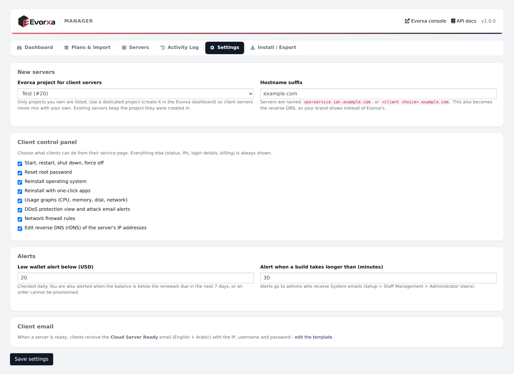
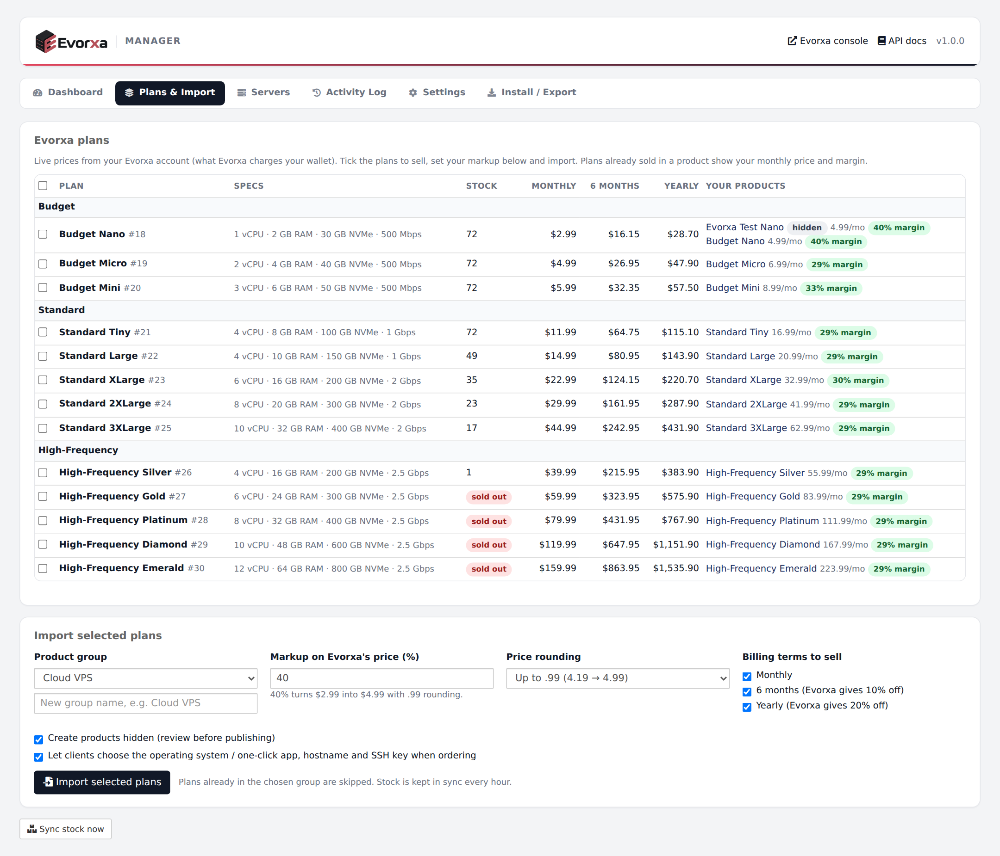
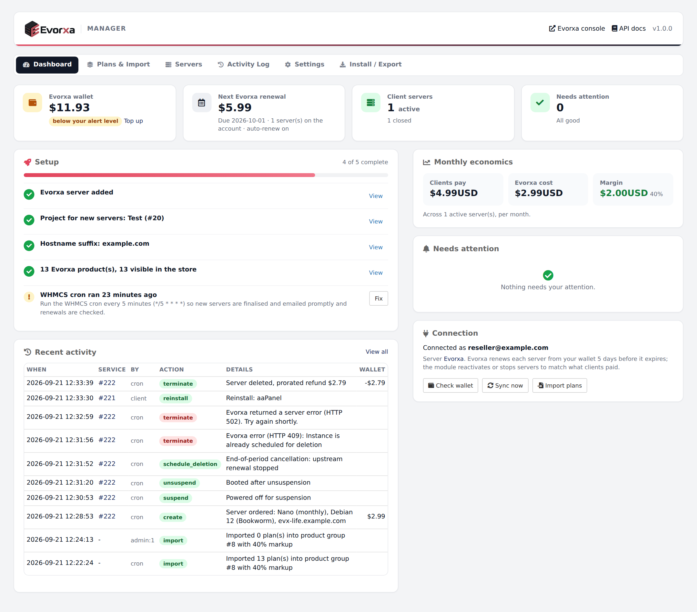
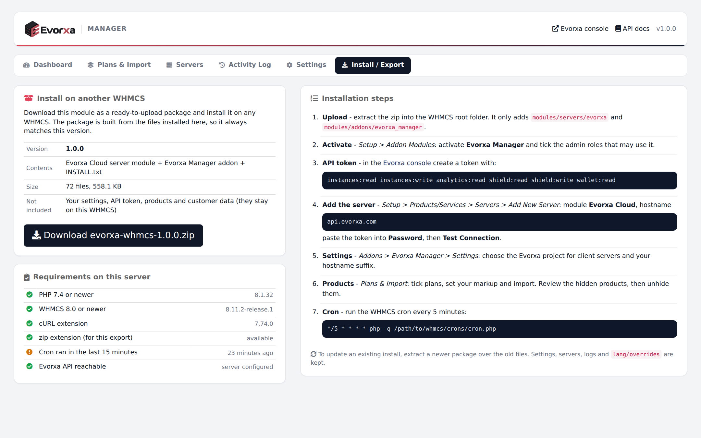

# Installation guide

This takes about 10 minutes. You need WHMCS admin access (Full Administrator) and an Evorxa account.

## Before you start

| Requirement | Why |
|---|---|
| WHMCS 8.0+ | Uses the WHMCS 8 module APIs |
| PHP 7.4 - 8.3 with cURL | Talks to the Evorxa API over HTTPS |
| PHP zip extension (optional) | Only for *Install / Export* |
| WHMCS cron every 5 minutes | Finishes new servers, sends the ready email, checks renewals and stock |
| Evorxa wallet balance | Servers and renewals are paid from your Evorxa wallet |

> **Tip:** create a dedicated project in the Evorxa dashboard (for example "Resale") before you start. Client servers are created there, so they never mix with your own servers.

## 1. Upload the files

Extract the package into your WHMCS root folder (the folder that contains `init.php`). It only adds two folders:

```
modules/servers/evorxa/          <- provisioning module, client panel, templates, docs
modules/addons/evorxa_manager/   <- Evorxa Manager addon (admin pages, background sync)
```

Nothing else in WHMCS is modified.

## 2. Activate Evorxa Manager

1. Go to **Setup > Addon Modules** (WHMCS 8: *System Settings > Addon Modules*).
2. Find **Evorxa Manager** and click **Activate**.
3. Click **Configure**, tick the admin roles that may use it, and **Save Changes**.

Activation creates the module's tables and the *Cloud Server Ready* email template (English and Arabic). The addon also runs the module's background tasks, so it must stay active.

## 3. Create an Evorxa API token

In the Evorxa dashboard open **API tokens** and create a token with these abilities:

```
instances:read instances:write analytics:read shield:read shield:write wallet:read
```

Copy the token (it is shown only once).

## 4. Add the Evorxa server in WHMCS

1. Go to **Setup > Products/Services > Servers > Add New Server**.
2. Fill in:
   - **Name**: Evorxa
   - **Hostname**: `api.evorxa.com`
   - **Module**: *Evorxa Cloud*
   - **Password**: paste the API token
3. Click **Test Connection** - you should see a success message. If a token ability is missing, the message tells you which.
4. **Save Changes**.

## 5. Settings

Open **Addons > Evorxa Manager > Settings**:



- **Evorxa project for client servers** - the project new servers are created in.
- **Hostname suffix** - your domain, for example `example.com`. Servers are named `vps123.example.com` (or the name the client chose); this also becomes the reverse DNS, so your brand shows instead of Evorxa's.
- **Client control panel** - switch individual features on or off.
- **Alerts** - wallet threshold and build timeout. Alerts go to admins who receive *System* emails.

## 6. Import plans

Open **Addons > Evorxa Manager > Plans & Import**:



1. Tick the plans you want to sell (new plans are pre-ticked).
2. Choose a product group (or type a new group name).
3. Set your **markup** (for example 40 %) and **rounding** (x.99 is the default).
4. Choose the billing terms to sell (monthly, 6 months, yearly).
5. Keep *Create products hidden* ticked, then **Import selected plans**.

Each product gets: prices in every WHMCS currency, the operating system / one-click app options, an optional hostname field, stock control and upgrade paths to bigger plans. Review the products in **Setup > Products/Services**, then untick **Hide** to publish.

## 7. Cron

Make sure the WHMCS cron runs every 5 minutes:

```
*/5 * * * * php -q /path/to/whmcs/crons/cron.php
```

The dashboard's setup checklist shows when the cron last ran.

## Done

Open **Addons > Evorxa Manager > Dashboard**. When every item in *Setup* is green you are ready to sell.



## Updating

Extract a newer package over the old files. Settings, servers, logs and your `lang/overrides` are kept. If the new version changes the database, WHMCS runs the addon's upgrade automatically when you next open Evorxa Manager.

## Moving to another WHMCS

Open **Addons > Evorxa Manager > Install / Export** and download the package. It is built from the files installed on this WHMCS and includes these docs.



## Uninstalling

1. Terminate (or unlink) all Evorxa services first, so no server keeps billing your wallet.
2. Deactivate Evorxa Manager. Its data is kept on purpose (tables `mod_evorxa_*`).
3. Delete the two module folders.

## Installation troubleshooting

| Symptom | Fix |
|---|---|
| *Test Connection* fails with "token was rejected" | The token was mistyped or revoked - create a new one. |
| "token is missing: ..." | Edit the token's abilities in the Evorxa dashboard (step 3). |
| Module Settings dropdowns show "Choose the Server Group ..." | Set the product's *Server Group* to the group that contains your Evorxa server, save, reopen the tab. |
| Dashboard says the cron did not run | Fix the cron (step 7). |
| Evorxa Manager page is blank | Upload `modules/servers/evorxa` too - the addon uses its library. |
