# Evorxa Cloud for WHMCS

**Sell Evorxa VPS and VDS servers under your own brand.** Orders are provisioned automatically on your Evorxa account, your clients get a complete server control panel, and the Evorxa Manager keeps pricing, stock, renewals and alerts in line - so you can run a cloud hosting business without touching a hypervisor.

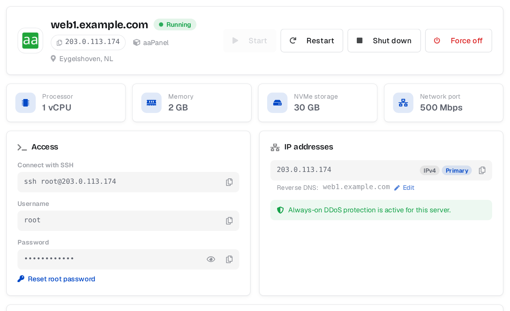

## Highlights

**Automatic provisioning**
- Paid orders create the server on Evorxa in about a minute; the client receives a branded "server ready" email with the IP and login.
- Suspend, unsuspend, terminate (with prorated refund to your wallet), upgrade and renewals are all handled automatically.
- Safe by design: a server is never bought twice, the module only touches servers it created, and every wallet charge and refund is logged.

**A control panel your clients will love** - replaces the service page's Overview tab in any theme (Lagom, Twenty-One, Six):
- Start / restart / shut down / force off, SSH or RDP details with one-click copy, root password reveal and reset
- IP addresses with **editable reverse DNS**
- Live **usage graphs** (CPU, memory, disk, network)
- **DDoS protection** view with filtered-vs-clean traffic, attack history and email alerts
- **Network firewall** with drag-and-drop rule order, default policies and an on/off switch
- **Reinstall** with any operating system or a one-click app (n8n, Coolify, WireGuard, cPanel, Pterodactyl and more)
- Fast (cached, skeleton loading), mobile friendly, English and Arabic (RTL) included, fully white-label

**A better order form** - one "Operating system or app" picker with logos, OS versions and one-click apps.

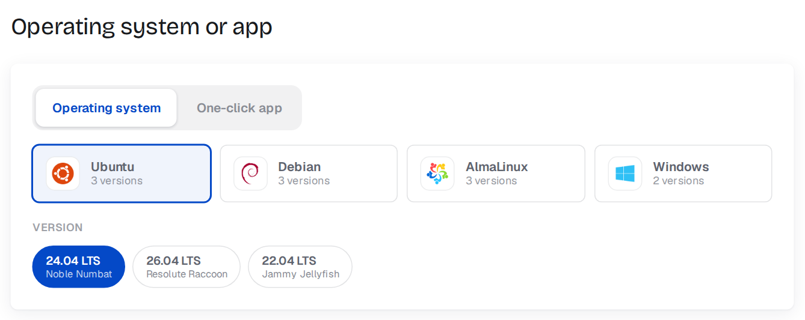

**Evorxa Manager (admin)**
- Dashboard with setup checklist, wallet, next renewal, monthly revenue vs cost, and anything that needs attention
- **One-click plan import** with your markup and price rounding, stock kept in sync every hour
- Server reconciliation (unmanaged or orphaned servers), full activity log with wallet charges and refunds
- Low-wallet, failed-build and drift alerts
- **Install / Export**: download an upload-ready package of the installed module

## Requirements

- WHMCS 8.0 or newer
- PHP 7.4 - 8.3 with cURL (and zip for the export feature)
- The WHMCS cron running every 5 minutes
- An Evorxa account with wallet balance and an API token

## Documentation

- [Installation guide](INSTALL.md) - upload, activate, connect your Evorxa account, import plans
- [How to use](USAGE.md) - daily operation for admins, what clients can do, customising, troubleshooting
- [Changelog](CHANGELOG.md)

## Screenshots

| | |
|---|---|
| 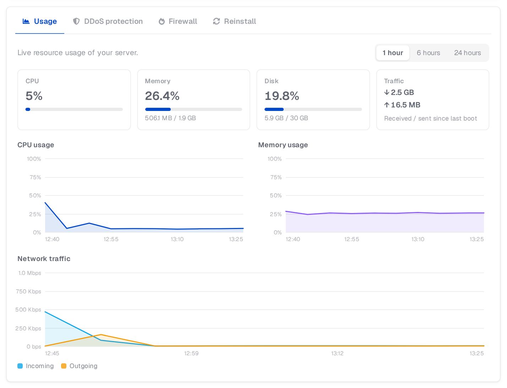 | 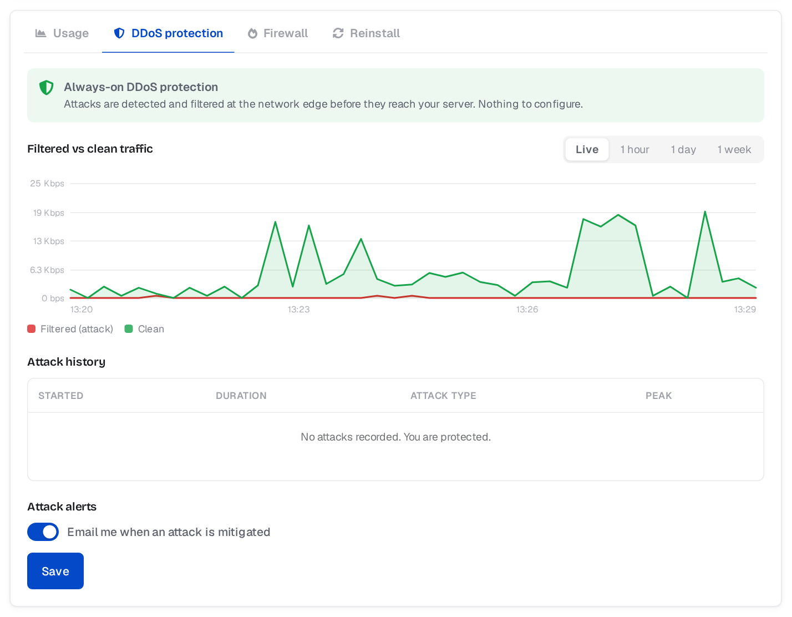 |
| 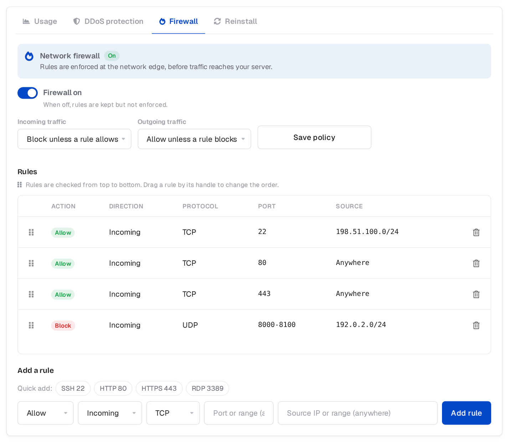 | 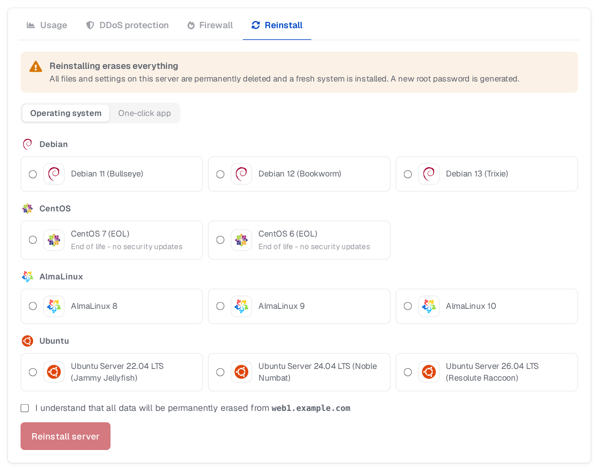 |
| 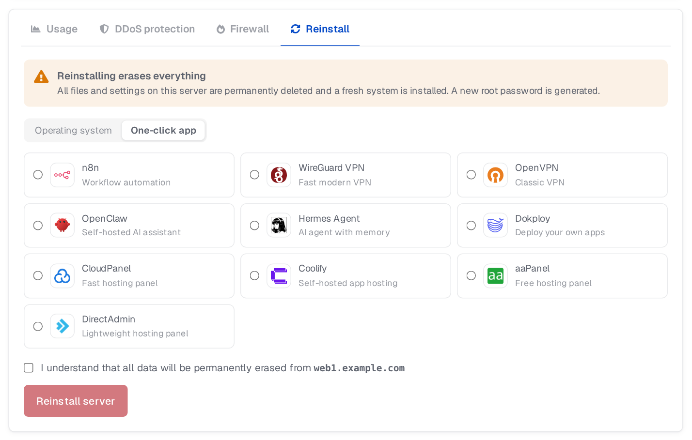 | 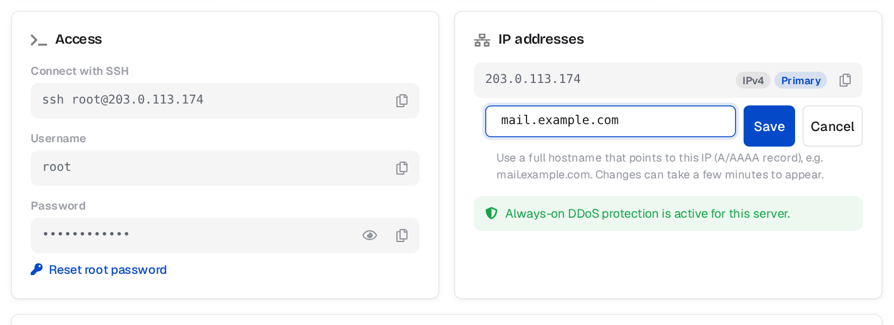 |
| 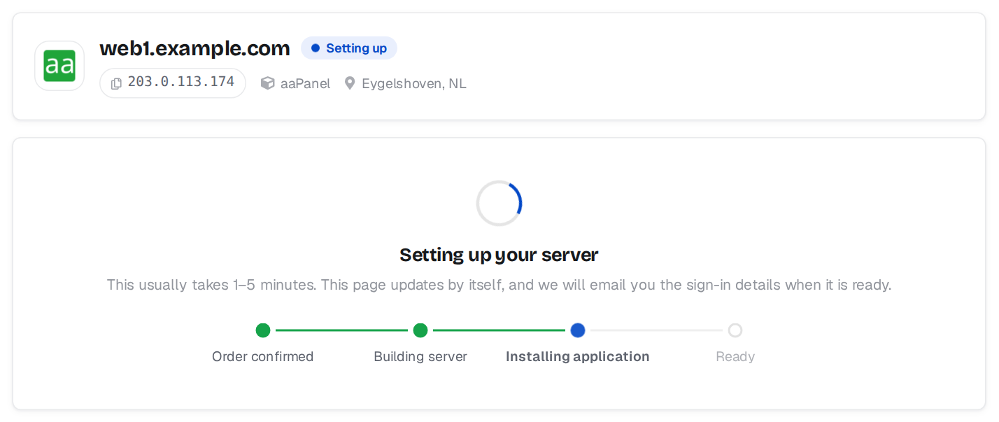 | 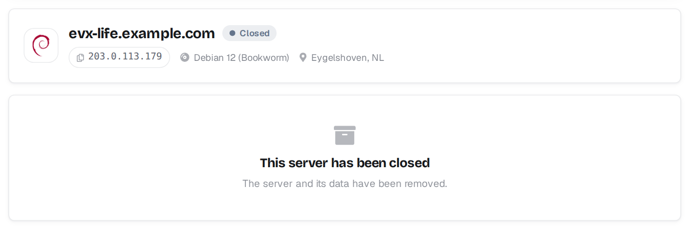 |
| 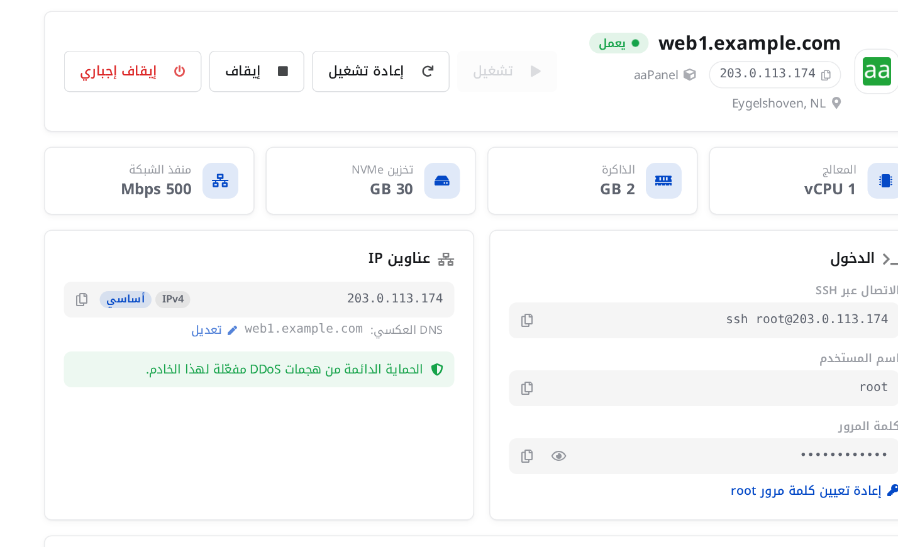 |  |
| 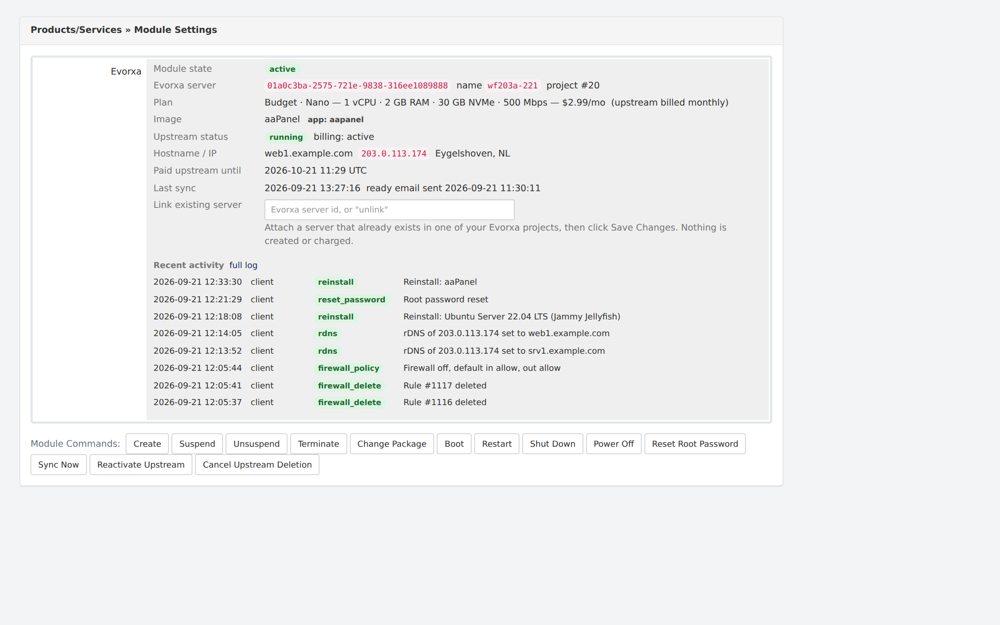 | 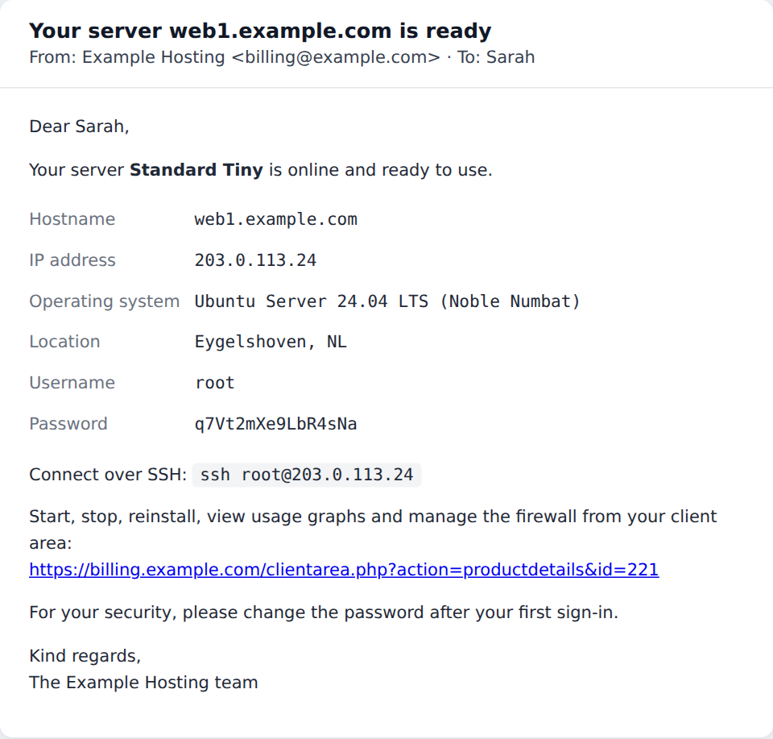 |

## Support

Evorxa is operated by ScaleBit Technologies. For the API and your Evorxa account: <https://evorxa.com> - support@evorxa.com.
