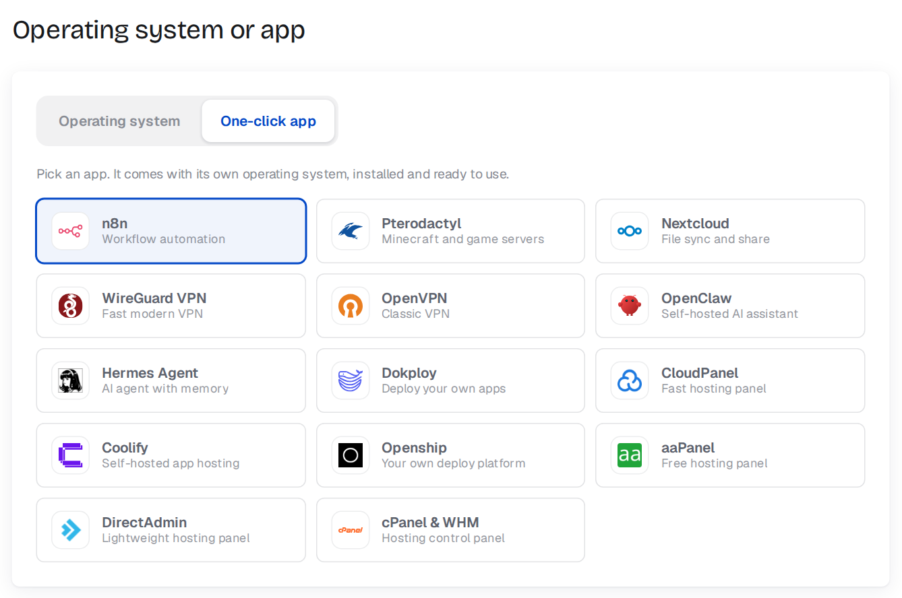
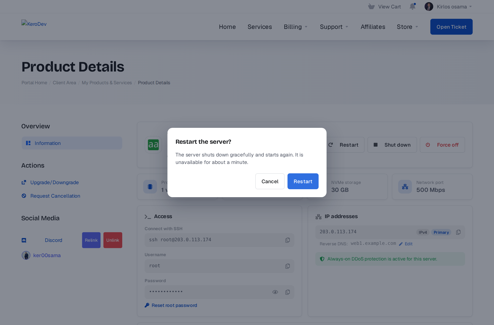

# How to use Evorxa Cloud

- [For admins](#for-admins) - selling, daily operation, billing, tools
- [For your clients](#for-your-clients) - the server control panel
- [Customising](#customising) - templates, wording, colours, logos, email
- [Troubleshooting & FAQ](#troubleshooting--faq)

---

## For admins

### How an order becomes a server

1. The client orders a product, picks an operating system **or** a one-click app, and optionally a hostname.

   
   

2. When the invoice is paid, WHMCS runs **Create**: the module checks stock and your wallet, then orders the server on Evorxa in your chosen project.
3. The client's page shows the progress while the server is built (usually 1-5 minutes):

   

4. As soon as it is running, the IP, username and root password are saved on the service and the client receives the **Cloud Server Ready** email:

   

### What happens on each WHMCS action

| WHMCS | On Evorxa |
|---|---|
| Create | Server ordered (paid from your wallet for one period) |
| Suspend | Server powered off; the client panel shows a suspended notice |
| Unsuspend | Reactivated if Evorxa suspended it, pending deletion cancelled, powered on |
| Terminate | Server deleted immediately; Evorxa refunds the unused time to your wallet |
| Upgrade / Change Package | Plan changed on Evorxa (the difference is prorated from your wallet), server rebooted |
| Renewal paid | The renewal keeper checks the server (see below) |

### Billing and renewals

- **You pay Evorxa from your wallet; your clients pay you in WHMCS.** Evorxa renews each server from your wallet 5 days before it expires.
- The **renewal keeper** keeps both sides in line automatically:
  - a server Evorxa suspended (for example because the wallet was short) while the client has paid is **reactivated** and you get an alert;
  - an **end-of-period cancellation** request stops the Evorxa renewal in time, so you don't pay for a period nobody uses;
  - a pending deletion on an active service is cancelled;
  - if you turned Evorxa auto-renew off, the server is extended only after the client has paid.
- Upstream billing term: by default the Evorxa term matches the client's term (monthly, 6 months or yearly - the cheaper Evorxa prices). Per product you can switch to *Always monthly* in **Module Settings**.
- Free and one-time billing cycles are refused (Evorxa would bill your wallet forever).
- **Keep your wallet topped up.** Evorxa Manager emails you daily when the balance is below your alert level or below the renewals due in the next 7 days.

### The dashboard

- **Setup** - what is still missing (server, project, hostname suffix, products, cron).
- **Wallet / Next renewal** - your Evorxa balance and the next charge.
- **Monthly economics** - what clients pay per month versus what Evorxa costs, and your margin.
- **Needs attention** - orders that failed or are waiting for confirmation.
- **Check wallet / Sync now** - run the checks immediately.

### Plans & Import

- Live Evorxa prices, stock and, for plans you already sell, your price and margin.
- Import more plans at any time; plans already in the chosen group are skipped.
- Stock is synced every hour, so sold-out Evorxa plans cannot be ordered.
- To change prices later, edit the products in **Setup > Products/Services** as usual.

### Servers

Every server in the projects this WHMCS uses, with its WHMCS service. Flags:

- **unmanaged** - exists on Evorxa but no WHMCS service is linked (still billed to your wallet);
- service **Terminated/Cancelled** but the server still exists;
- **suspended upstream** while the service is active.

Your other Evorxa projects are never listed or touched.

### The service page

Open a client's service (**Clients > Products/Services**). The **Evorxa** tab shows the server, plan, image, upstream status, paid-until date and recent activity:

- **Link existing server**: paste an Evorxa server id to attach a server that already exists (nothing is created or charged), or type `unlink`.
- **Module Commands**: Boot, Restart, Shut Down, Power Off, Reset Root Password, Sync Now, Reactivate Upstream, Cancel Upstream Deletion.

### Activity log

Every action sent to Evorxa - by clients, admins and the cron - with the result and the wallet charge or refund. Filter by service id. For raw API calls enable **Utilities > Logs > Module Log** (the token and passwords are masked).

### Alerts

Admins who receive *System* emails are notified about: low wallet, a server that could not be created, a build that takes longer than your timeout, an ordered app that did not install, a server suspended upstream while the client is paid up, and servers missing upstream.

---

## For your clients

The client's service page shows a complete control panel (any theme, desktop and mobile, English and Arabic).

- **Power**: Start, Restart, Shut down, Force off (with confirmation).

  

- **Access**: SSH command (or RDP address for Windows), username, root password (hidden until *Show*), **Reset root password**.
- **IP addresses** with **reverse DNS** - click *Edit* to change it:

  

- **Usage** - CPU, memory, disk and network for the last hour, 6 hours or 24 hours:

  

- **DDoS protection** - filtered vs clean traffic, attack history, email alerts:

  

- **Firewall** - turn it on or off, set the default policy, add rules (quick add for SSH/HTTP/HTTPS/RDP, port ranges, source IP or range) and **drag rules to change their order**. Rules are checked top to bottom:

  

- **Reinstall** - pick an operating system or a one-click app; a checkbox confirms that all data will be erased:

  
  

- **Billing** - price, next due date, upgrade and cancellation links.

---

## Customising

- **Features** - switch any client feature off in **Evorxa Manager > Settings**.
- **Templates** - `modules/servers/evorxa/templates/overview.tpl` and `templates/partials/*.tpl`. All data is in one `{$evx}` variable, documented at the top of `overview.tpl`. Templates only use `{$var|escape}`, `{if}` and `{foreach}`, so they work with WHMCS's template security.
- **Wording and languages** - put your changes in `modules/servers/evorxa/lang/overrides/<language>.php` (only the keys you change; kept when you update). Add a language by copying `lang/english.php` to `lang/<language>.php`.
- **Colours** - the panel follows your theme's `--brand-primary`; override any `--evx-*` CSS variable in your theme's custom CSS.
- **Logos** - operating system and app logos are in `templates/assets/logos/{os,apps}/<name>.svg|png`; replace or add your own.
- **Email** - edit **Cloud Server Ready** in **Setup > Email Templates** (English and Arabic are included). Extra merge fields: `{$evx_os}`, `{$evx_location}`, `{$evx_app_name}`, `{$evx_app_url}`, `{$evx_app_username}`, `{$evx_app_password}`, `{$evx_app_note}`, `{$evx_app_missing}`, `{$evx_panel_url}`, plus the standard `{$service_*}` fields.

---

## Troubleshooting & FAQ

**A new order stays "Pending" / shows in the Module Queue.**
Open the service's Evorxa tab - the last error explains it (wallet too low, plan out of stock, no project chosen). Fix it and click **Create** again. If the order *timed out* talking to Evorxa it shows as *unknown*: the module checks automatically every cron run and adopts the server if it was created, so do not retry for 15 minutes.

**The client did not get the ready email.**
It is sent once the server is running (and its app is ready). Check the Evorxa tab's *ready email sent* time and **Utilities > Logs > Email Message Log**. Make sure the cron runs every 5 minutes.

**The Firewall or another tab is missing for a client.**
Either the feature is switched off in Settings, or Evorxa locked it for that server.

**"The server panel is busy".**
Evorxa allows 60 API requests per minute per token. The panel caches data and backs off automatically; use a separate token for each WHMCS installation.

**Can I use one Evorxa account for several WHMCS installs?**
Yes. Server names include a random per-install prefix, and each install only manages the servers it created. Use one project (and token) per install.

**What is never shown to clients?**
Your API token, Evorxa project and ids, your costs and Evorxa billing data, and upstream error messages. The root password is only shown when the client clicks *Show*.
